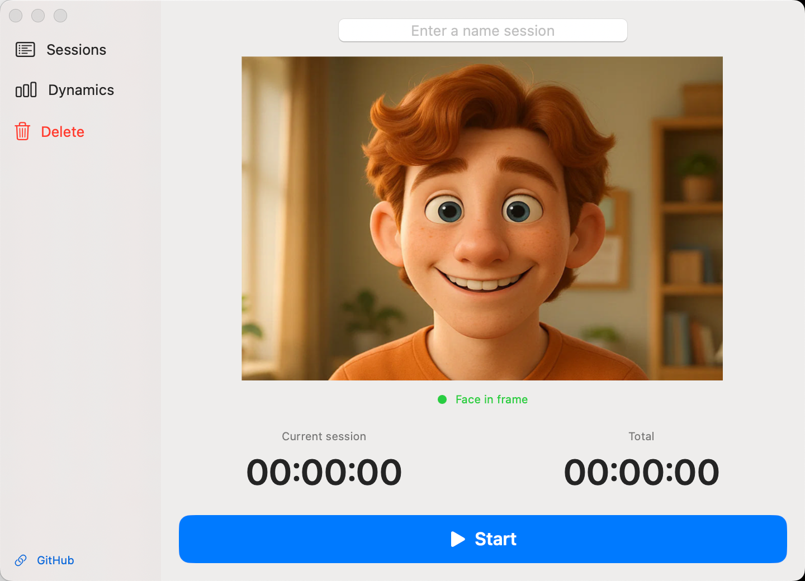
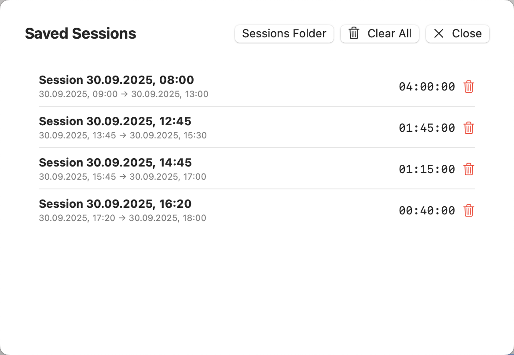
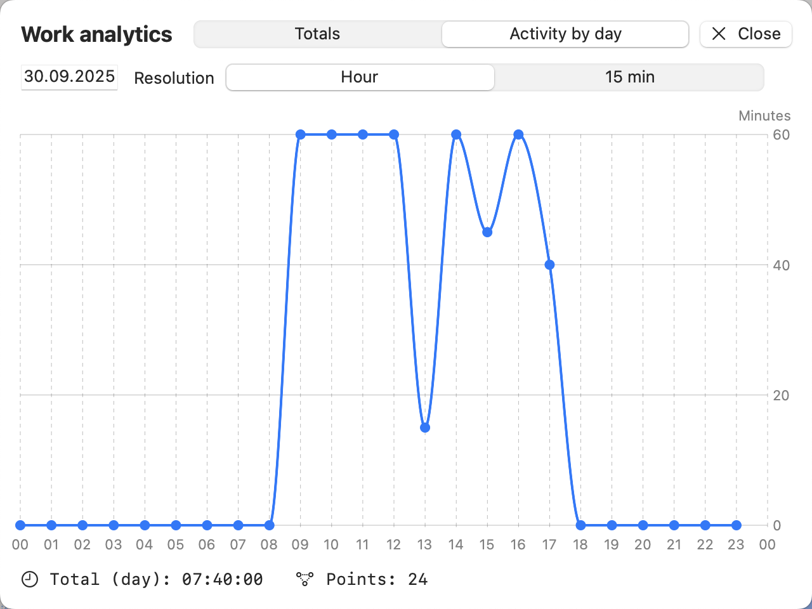

# DeskPresence

I was looking for a time tracker with a minimal interface — something that doesn’t require me to constantly click buttons whenever I leave or return to my desk. **DeskPresence** solves this by keeping the workflow simple: just two clicks — start of the workday and end of the workday. From there, OpenCV automatically detects if you are present at the desk and tracks your active time. As soon as you step away, the timer pauses.

**DeskPresence** is a lightweight macOS app that tracks your focused time at the desk — it detects whether your face is visible to the camera and accumulates active time locally. No uploads, no cloud, no accounts.

**Platform:** macOS (SwiftUI) · **Requires:** macOS 13+  
**Tech:** AVFoundation · Vision · (optional) OpenCV wrapper · SwiftUI · Swift Charts

---

## Features

- **Face-presence time tracking** — counts time only while your face is visible to the webcam.
- **On-device only** — frames are not stored or uploaded; logs live in `~/Documents/DeskPresence`.
- **Sessions** — start/stop with a custom name, review, and delete saved sessions.
- **Analytics**
  - Totals over the last 7/30/90 days or all time.
  - Per-day activity with 1-hour or 15-minute resolution.
- **Clean UI**
  - Left panel: *Sessions*, *Dynamics*, *Delete All*.
  - Right panel: camera preview, session name, timers, and a wide **Start/Stop** button.
  - Live status: **Face in frame** / **Face not visible**.
- **CSV heartbeat** — periodic heartbeats so progress isn’t lost on unexpected quits.

---

## Screenshots

---

## How it works

- **CameraController** captures frames (AVFoundation) and runs **Vision** (`VNDetectFaceRectanglesRequest`) to detect face presence.
  *(Optional)* an **OpenCV** wrapper converts pixel buffers to `NSImage` for the live preview.
- **SessionTracker** manages session state (start/stop, grace windows), accumulates time, and logs chunks/heartbeats to CSV.
- **SessionStore** persists sessions to `~/Documents/DeskPresence/sessions.json`.
- **CSVLogger** appends rows to `~/Documents/DeskPresence/sessions.csv`.
- **SwiftUI** powers the entire UI, including charts via Swift Charts.

---

## Privacy

- All processing happens on your Mac.
- Video frames are **not** saved; only “face present” state is used.
- Local data in `~/Documents/DeskPresence`:
  - `sessions.json` — saved sessions.
  - `sessions.csv` — events & heartbeats.
- **Delete All** wipes both files and removes the folder if empty.

---

## Requirements

- **macOS 13 Ventura or newer** (for Swift Charts).
- **Xcode 15+** recommended.
- Camera permission on first run.

